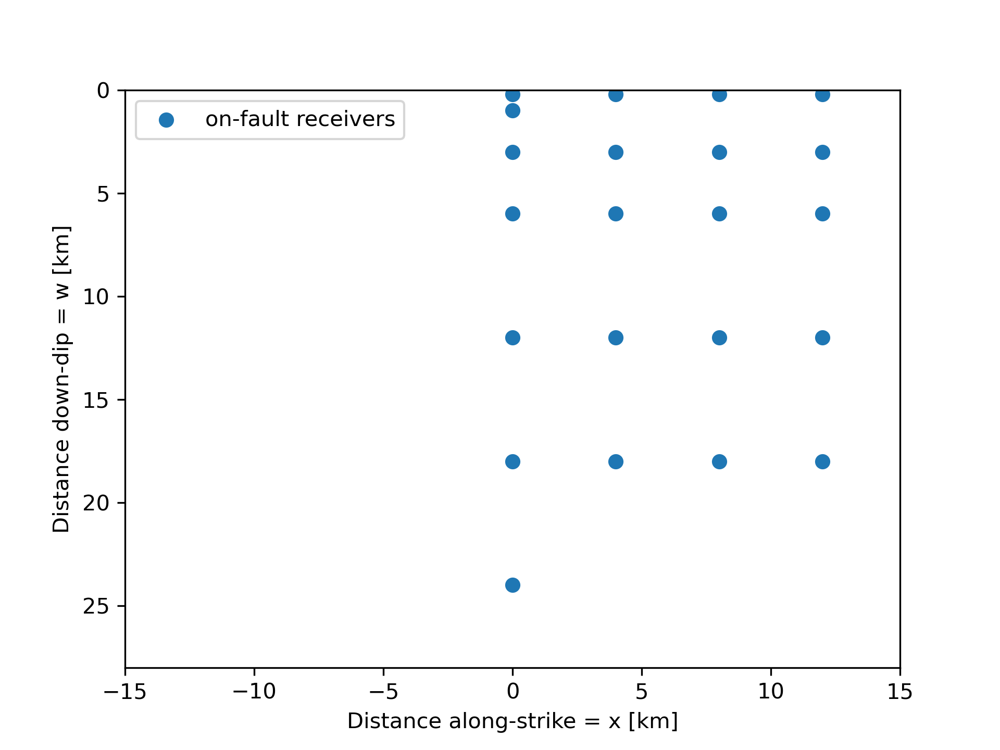
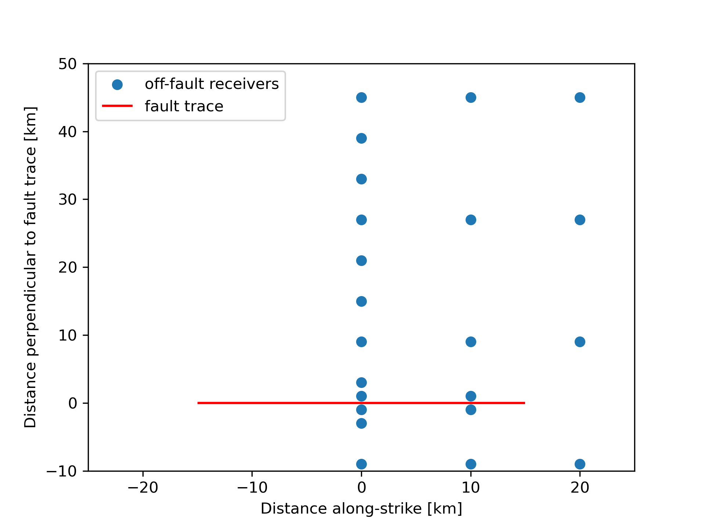

# Benchmarks
This repository contains code and mesh files needed for different TPV (The Problem Version) benchmark problems.

Please refer to:
- [The SCEC/USGS Spontaneous Rupture Code Verification Project](https://strike.scec.org/cvws)

## On-Fault Stations

## Off-Fault Stations

